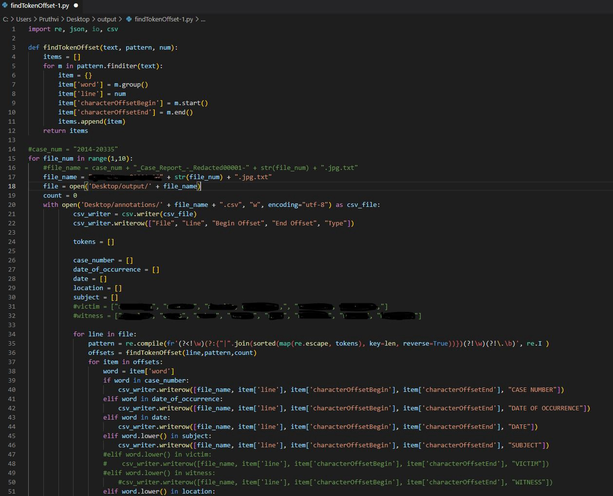
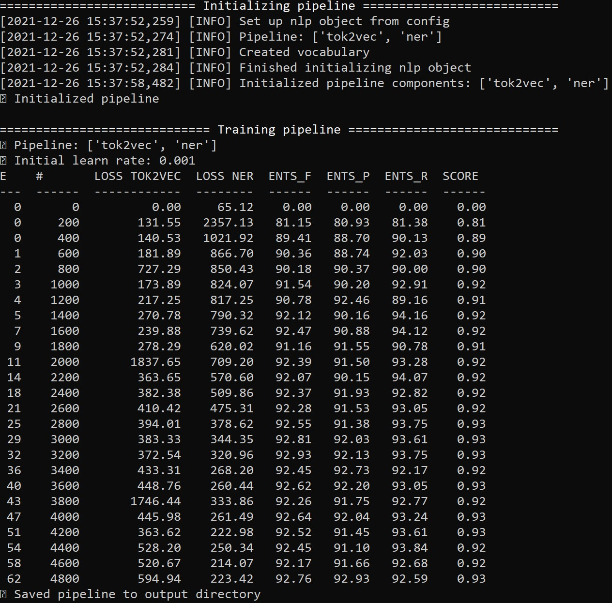

# NER Model for Police Case Files

## Inspiration

When corroborating stories or uncovering social issues, a key source of evidence journalists and reporters refer to is police case records. These records can vary in size, 
from a few sentences to hundreds of pages! 
They are also painstakingly confusing and laborious for journalists to read through.
This semester, our team and advisors tackled the issue of simplifying understanding police case records. More specifically, using Python, PostgreSQL, Amazon Textract, and 
spaCY, we began automating the process of identifying key insights from police records.

## Early Stages
We started with a set of police records obtained through a local media outlet from a police department. This would serve as our training data for the NLP model we would 
create later on. Using Amazon Textract, an OCR Machine Learning service that extracts text from scanned documents, we were able to analyze the text into .txt files. 
Next, using our Python script, we easily processed dozens of case files and BIO-tagged important information, like case numbers, victims, officers, key locations, 
subjects involved, and dates. BIO-tagging, (beginning, inside, outside), which describes the location/length of these important pieces within the text, is used in 
training NLP algorithms.

### Python Script

After gathering our training data from almost 2 dozen case files (~1000 pages of case files), we fed the data into Amazon Comprehend, an NLP service with 
Name-Entity-Recognition capabilities. After several rounds of training, we noticed our NER model perform fairly well on a test set of case files; 
it was able to recognize nearly all of the important information in the text. However, we still needed far more training data.

### Amazon Comprehend

## Issues
Unfortunately, the process of gathering training data itself was quite lengthy. Specifically, reading through each case to determine the 
important information to tag was cumbersome. Using our PostgreSQL script and the police department’s public database, we could gather all the important 
information to tag, feed it into our Python script, and develop training data far quicker and easier.

## [Current spaCY NER Model](https://github.com/pruthvi-innamuri/policing-ner-model/tree/main/policingnotebook/ner_model)
I recently developed this spaCY NER model using the teams' training data. This model displays higher precision and accuracy during training 
and generalizes better across unseen police case files of different formats compared to the Amazon Comprehend one. Moreover, it is more cost-effective to 
journalists. Hence, we will be moving forward with a spaCY model that combines features of my model and my partner's model.

### Model Precision, Accuracy, Recall, Loss During Training

## Future Steps
In the future, we aim to improve the NER model itself by gathering more training data so that our model is generalizable to the millions of police records across the country.
Later on, we hope to package the OCR, data processing/training, and NER steps into a cohesive self-learning program for journalists to begin using.

## Disclaimer
Most of the sensitive training data in this project has been removed. Please be respectful of the nature of this project and don't openly share it. Thank you!
